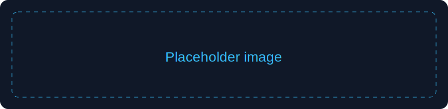

# Bienvenida

Este post sirve como plantilla inicial para probar la estructura del blog.

## Markdown soportado

- **Negrita**
- *Cursiva*
- Listas y títulos
- Imágenes



## Código con resaltado

```javascript
const saludo = 'Hola desde un bloque de código';
console.log(saludo);
```

## Código ejecutable (JavaScript)

> Usa el lenguaje `javascript runnable` para habilitar el botón Run.

```javascript runnable
const root = document.createElement('div');
root.style.color = '#38bdf8';
root.textContent = 'Código ejecutado dentro del iframe sandbox';
document.body.append(root);
```

## Zona de interactividad del post

<div id="post-interactive-zone"></div>
